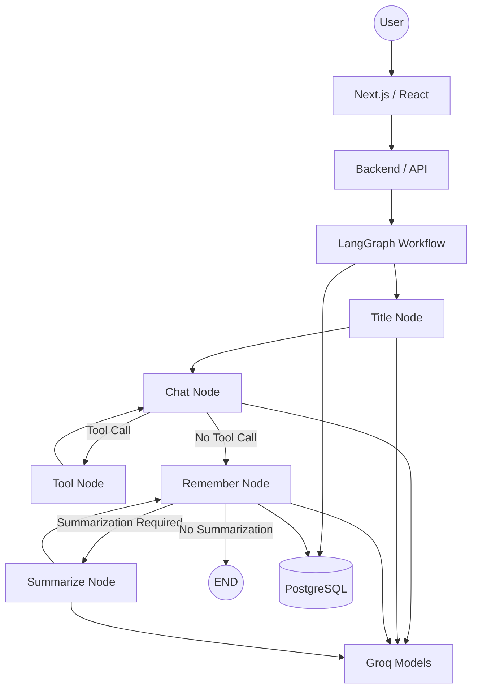
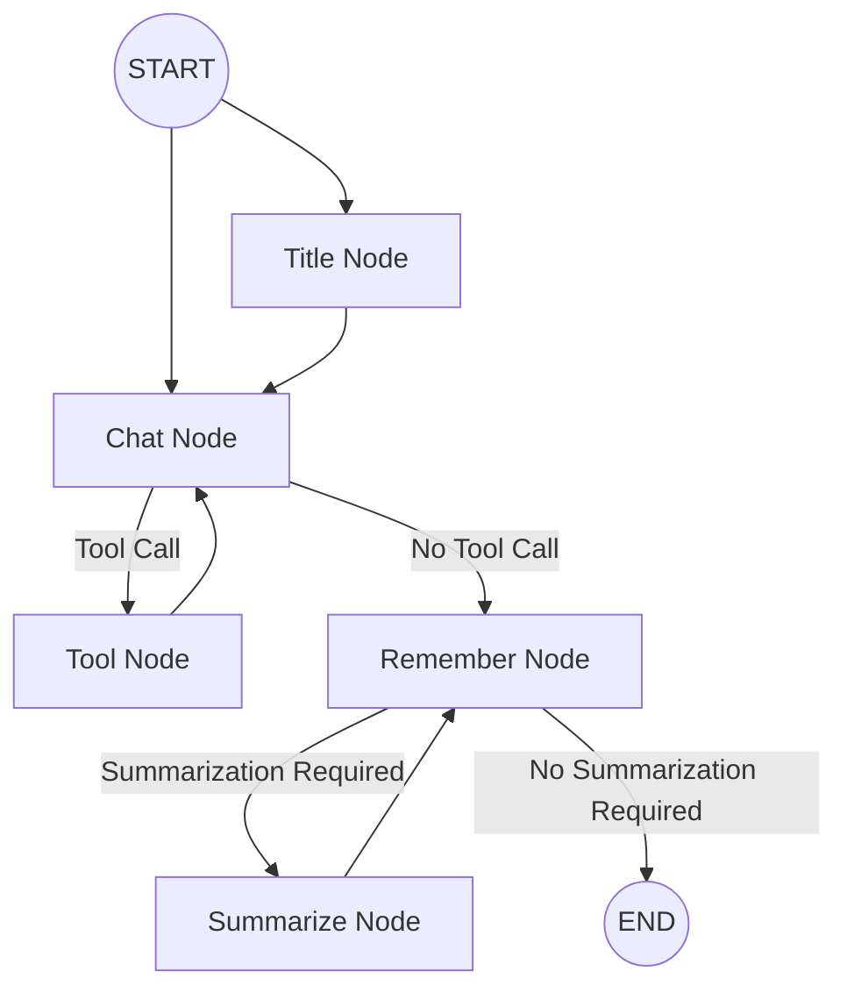
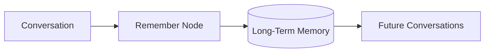
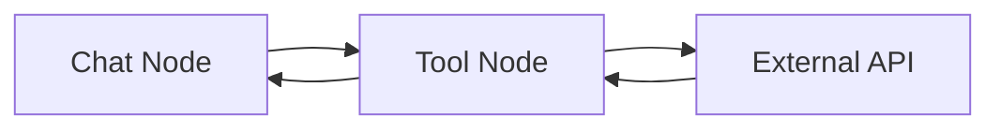
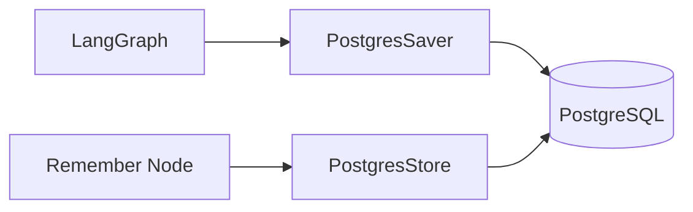

# 🤖 Nexus AI

> A full-stack AI assistant built with **Next.js, TypeScript, LangGraph, LangChain, Groq, and PostgreSQL**.

Nexus AI is a stateful AI assistant designed to demonstrate how modern AI applications can combine **LLMs, tools, memory, persistence, and streaming** into a single workflow.

---

## ⚠️ Important Note — Groq TPM / TPD Limits

During development, Nexus AI encountered **Groq TPM (Tokens Per Minute) and TPD (Tokens Per Day) rate-limit errors**.

This happens because Nexus AI can perform multiple LLM operations during a conversation, including:

- Chat generation
- Tool calling
- Memory processing
- Conversation title generation
- Summarization

Therefore, token usage can grow quickly.

I initially experimented with Hugging Face models, but their inference limitations also became a bottleneck. I moved to **Groq** and designed the application to support **multiple Groq model configurations** for different workflow tasks.

> **Important:** Using multiple API keys does not bypass Groq's TPM/TPD limits. Each key/account remains subject to the provider's applicable limits.

This limitation was an important part of the project's architecture and model-selection decisions.

---

# ✨ Features

- 💬 AI-powered conversations
- 🏷️ Automatic conversation titles
- 🧠 Long-term user memory
- 🔄 Autonomous memory create/update/delete
- 📝 Conversation summarization
- 🛠️ Tool calling
- ⚡ Streaming responses
- 💾 PostgreSQL persistence
- 🤖 Multiple Groq model configurations
- 🔧 Modular LangGraph workflow

---

# 🏗️ Architecture



---

# 🔄 LangGraph Workflow

The core workflow is:



### How it works

**1. Title Node**
Generates a title for a new conversation.

**2. Chat Node**
Handles the main conversation and decides whether a tool is required.

**3. Tool Node**
Executes the requested tool and sends the result back to the Chat Node.

**4. Remember Node**
Analyzes the conversation and decides whether information should be:

- Created
- Updated
- Deleted
- Ignored

**5. Summarize Node**
Compresses conversation context when it becomes too large, then returns to the Remember Node.

---

# 🧠 Memory

Nexus AI has two types of memory.

### Short-Term Memory

Maintains the current conversation context.

### Long-Term Memory

Stores useful information about the user across conversations.



Example:

```text
User: I prefer concise answers.

        ↓

Remember Node

        ↓

Long-Term Memory

responseStyle = concise
```

---

# 🛠️ Tools

Nexus AI currently supports:

| Tool           | Purpose                   |
| -------------- | ------------------------- |
| 🧮 Calculator  | Mathematical calculations |
| 🌤️ Weather     | Weather information       |
| 💱 Currency    | Currency conversion       |
| 📈 Market Data | Market information        |
| 🌎 World Time  | Current time by location  |

Tool execution follows:



---

# ⚡ Streaming

Responses are streamed to the frontend instead of waiting for the complete response.

The backend uses structured events such as:

```typescript
interface StreamEvent {
  type: "token" | "title" | "status" | "done" | "error";
  content?: string;
  node?: string;
  message?: string;
  conversationId?: string;
}
```

This allows the frontend to display generated responses in real time.

---

# 💾 Persistence

PostgreSQL is used for persistent LangGraph state and long-term memory.



This allows conversations and user memory to persist across sessions.

---

# 🧰 Tech Stack

| Technology   | Usage                     |
| ------------ | ------------------------- |
| Next.js      | Full-stack framework      |
| React        | Frontend                  |
| TypeScript   | Type safety               |
| LangGraph    | AI workflow orchestration |
| LangChain    | LLM & tool integration    |
| Groq         | LLM inference             |
| PostgreSQL   | Persistence               |
| Tailwind CSS | Styling                   |
| Lucide React | Icons                     |

---

# 📁 Project Structure

```text
src/
├── langgraph/
│   ├── nodes/
│   │   ├── chat.node.ts
│   │   ├── remember.node.ts
│   │   ├── summarize.node.ts
│   │   └── title.node.ts
│   │
│   ├── tools/
│   │   ├── calculator.tool.ts
│   │   ├── weather.tool.ts
│   │   ├── currency.tool.ts
│   │   ├── market.data.tool.ts
│   │   └── world.time.tool.ts
│   │
│   ├── states/
│   │   └── chat.state.ts
│   │
│   └── workflow/
│
├── utils/
└── ...
```

---

# 🚀 Getting Started

### 1. Clone the repository

```bash
git clone <repository-url>
cd nexus-ai
```

### 2. Install dependencies

```bash
npm install
```

### 3. Create `.env`

```env
POSTGRES_DATABASE_URL=your_postgres_url

GROQ_API_KEY=your_groq_api_key

WEATHER_API_KEY=your_weather_api_key

CURRENCY_API_KEY=your_currency_api_key

MARKET_DATA_API_KEY=your_market_api_key
```

### 4. Start the application

```bash
npm run dev
```

---

# 🎯 Why I Built Nexus AI

The goal of Nexus AI is to explore how to build an AI application beyond a simple:

```text
User → LLM → Response
```

Instead, the system uses:

```text
User
 ↓
LangGraph Workflow
 ↓
LLM + Tools + Memory + Summarization
 ↓
Persistent State
 ↓
Streaming Response
```

This project helped me work with real-world challenges such as **LLM rate limits, state management, prompt engineering, tool integration, persistent memory, and streaming architectures**.

---

# 👨‍💻 Author

**Dhruv Solanki**

### Link - https://ds-nexusai.vercel.app/

Nexus AI is a portfolio project focused on **AI engineering, LLM workflows, agentic systems, memory, and full-stack development**.
