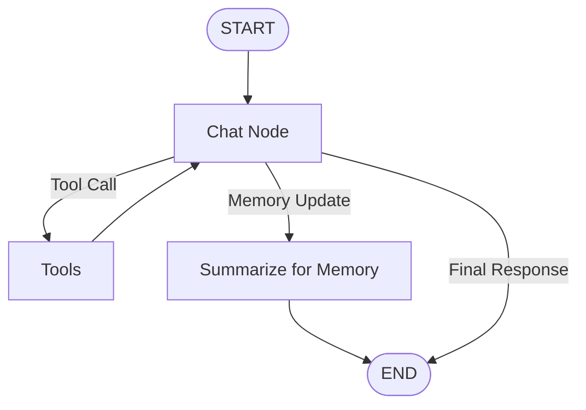
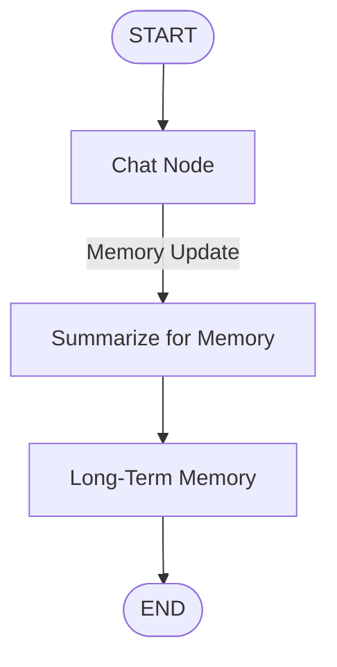

# Memory in NEXUS AI

Memory allows NEXUS AI to maintain context during a conversation and retain useful information across different conversations. The system uses **short-term memory** for the current thread and **long-term memory** for information that should persist beyond it.

## NEXUS AI Memory Workflow

The memory flow is integrated into the LangGraph agent workflow:



The **Chat Node** is the central decision point. After processing the user's request, the workflow can call a tool, update memory, or finish with a response.

If a tool is required, the request moves to `Tools`. Once the tool finishes, its result returns to the Chat Node, which can continue processing.

If the conversation contains information that should be remembered, the workflow moves to `Summarize for Memory`.

---

## Short-Term Memory

Short-term memory is **thread-based** and represents the current conversation.

As a conversation grows, keeping every message in the active context becomes inefficient. NEXUS AI can keep the most recent messages while summarizing older messages.

For example:

```text
Older Messages
      ↓
Summarize
      ↓
Conversation Summary
      +
Recent Messages
```

Instead of sending an entire conversation to the model, the Chat Node can work with:

```text
Conversation Summary
+
Recent Messages
+
Current User Message
```

This preserves the important context while keeping the active conversation smaller.

---

## Long-Term Memory

Long-term memory is different because it can persist across multiple conversations.

For example:

```text
User:
I prefer TypeScript for my projects.
```

The system can determine that this information is worth remembering and create a memory such as:

```text
User prefers TypeScript for projects.
```

When a future conversation is related to the user's technology preferences, the relevant memory can be retrieved and provided to the Chat Node.

```text
Previous Conversation
        ↓
Long-Term Memory
        ↓
Relevant Memory Retrieved
        ↓
Chat Node
        ↓
Response
```

---

## Memory Updates and Deduplication

NEXUS AI should not store every message as a new memory.

Suppose the existing memory is:

```text
User prefers JavaScript.
```

The user later says:

```text
I have switched to TypeScript for my projects.
```

The memory system can compare the new information with existing memories and determine that the existing memory should be updated rather than creating a duplicate.

Conceptually:

```text
New Memory
    ↓
Check Existing Memories
    ↓
Duplicate? → Ignore
Changed?   → Update
New?       → Create
```

This keeps long-term memory more useful and avoids unnecessary duplication.

---

## Checkpointing

NEXUS AI also uses LangGraph's **checkpointer** concept to persist graph and thread state.

A checkpointer and long-term memory serve different purposes:

```text
Checkpointer
→ Persists conversation / graph state.

Long-Term Memory
→ Persists useful information across conversations.
```

LangGraph checkpoints state during graph execution, allowing the application to resume and maintain state across interactions.

---

## Example Using the NEXUS AI Workflow

Suppose the user says:

```text
I'm building my projects with TypeScript
and I want to use it for future AI projects.
```

The Chat Node can identify useful information and route the workflow through memory:



The stored memory could become:

```text
User prefers TypeScript for AI projects.
```

Later, when the user asks:

```text
What should I use for my next AI project?
```

the relevant memory can be retrieved and supplied to the Chat Node.

---

## In Simple Terms

NEXUS AI's memory system can be summarized as:

```text
Short-Term Memory
→ Remember the current conversation.

Long-Term Memory
→ Remember useful information across conversations.

Summarization
→ Compress older conversation context.

Checkpointer
→ Persist graph and thread state.

Chat Node
→ Decide whether to respond, use a tool, or update memory.
```

This allows NEXUS AI to maintain conversational context without keeping every message active forever, while also giving it the ability to remember useful information across conversations.

---

## My Note

The concepts described here are based on my learning, testing, and experimentation while building NEXUS AI and studying the LangChain and LangGraph documentation. These are the approaches I have used or explored in my project and are not necessarily the only or best approaches for implementing memory.

For a deeper understanding and production-oriented implementation, refer to the official documentation.

## Sources & Documentation

- [LangChain — Memory Concepts](https://docs.langchain.com/oss/javascript/concepts/memory)
- [LangChain — Short-Term Memory](https://docs.langchain.com/oss/javascript/langchain/short-term-memory)
- [LangChain — Long-Term Memory](https://docs.langchain.com/oss/javascript/langchain/long-term-memory)
- [LangGraph — Add Memory](https://docs.langchain.com/oss/javascript/langgraph/add-memory)
- [LangGraph — Persistence](https://docs.langchain.com/oss/javascript/langgraph/persistence)
- [LangGraph — Graph API](https://docs.langchain.com/oss/javascript/langgraph/graph-api)
- [NEXUS AI — GitHub Repository](https://github.com/DhruvSolanki01259/NexusAi)
