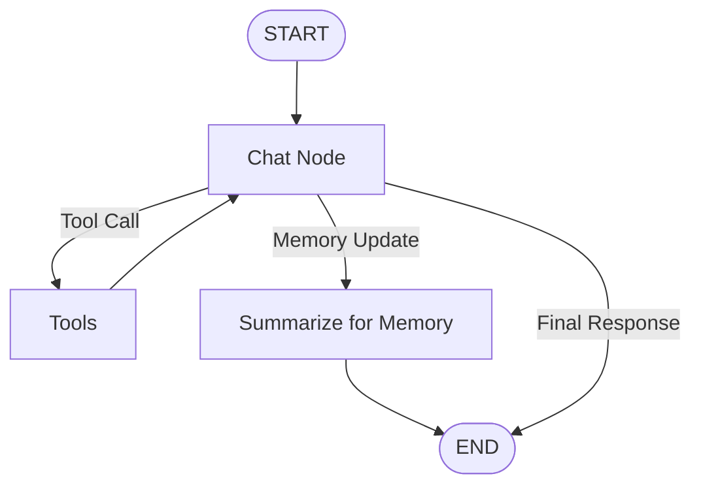

# Tools in NEXUS AI

Tools allow NEXUS AI to go beyond generating text by giving the AI the ability to interact with external systems and perform actions. NEXUS AI uses **LangChain tools** together with **LangGraph** to build an agentic workflow where the model can decide when a tool is required.

## NEXUS AI Tool Workflow

The workflow is centered around the **Chat Node**, which decides what should happen after processing the user's request.



When the user sends a query, it is passed to the Chat Node along with the available tools. If the model determines that a tool is required, it generates a tool call and the workflow moves to the `Tools` node.

The tool executes the requested operation and returns its result to the Chat Node. The model can then use that result to decide whether another tool call is required or whether it can generate the final response.

---

## Example

Suppose the user asks:

```text
What is the weather in Mumbai?
```

The Chat Node can determine that current weather information requires a tool.

```text
User Query
    ↓
Chat Node
    ↓
Tool Call
    ↓
Weather Tool
    ↓
Tool Result
    ↓
Chat Node
    ↓
Final Response
```

If the returned information is sufficient, the workflow ends. If another tool is required, the Chat Node can call another tool and continue the loop.

---

## Multiple Tool Calls

The agent is not limited to a single tool call.

For example, if a request requires searching for information and then performing a calculation, the workflow can be:

```text
Chat Node
    ↓
Search Tool
    ↓
Chat Node
    ↓
Calculator Tool
    ↓
Chat Node
    ↓
Final Response
```

The Chat Node acts as the decision-making layer between tool executions.

---

## Tool Calling vs Normal Response

Not every request requires a tool.

For a general question:

```text
User → Chat Node → Final Response
```

For a request requiring external information or an action:

```text
User → Chat Node → Tool → Chat Node → Final Response
```

This conditional behavior is what makes the workflow **agentic**. The model decides whether it needs to use the capabilities provided by the application instead of following a fixed sequence for every request.

---

## LangChain and LangGraph

**LangChain** provides the model and tool abstractions used to define and connect tools with the LLM.

**LangGraph** manages the workflow, state, conditional routing, and the loop between the Chat Node and Tools.

Together, they allow NEXUS AI to follow a flow such as:

```text
Understand Query
      ↓
Decide
      ↓
Use Tool
      ↓
Receive Result
      ↓
Decide Again
      ↓
Respond
```

This architecture allows NEXUS AI to interact with external capabilities while keeping the decision-making process inside the graph.

---

## My Note

The concepts described here are based on my learning, testing, and experimentation while building NEXUS AI and studying the LangChain and LangGraph documentation. These are the approaches I have used or explored in my project and are not necessarily the only or best approaches for implementing tools or agentic workflows.

For deeper understanding and production-oriented implementation, refer to the official documentation.

## Sources & Documentation

- [LangChain — Tools](https://docs.langchain.com/oss/javascript/langchain/tools)
- [LangChain — Agents](https://docs.langchain.com/oss/javascript/langchain/agents)
- [LangChain — Models](https://docs.langchain.com/oss/javascript/langchain/models)
- [LangGraph — Graph API](https://docs.langchain.com/oss/javascript/langgraph/graph-api)
- [LangGraph — Workflows and Agents](https://docs.langchain.com/oss/javascript/langgraph/workflows-agents)
- [LangGraph — Quickstart](https://docs.langchain.com/oss/javascript/langgraph/quickstart)
- [NEXUS AI — GitHub Repository](https://github.com/DhruvSolanki01259/NexusAi)
